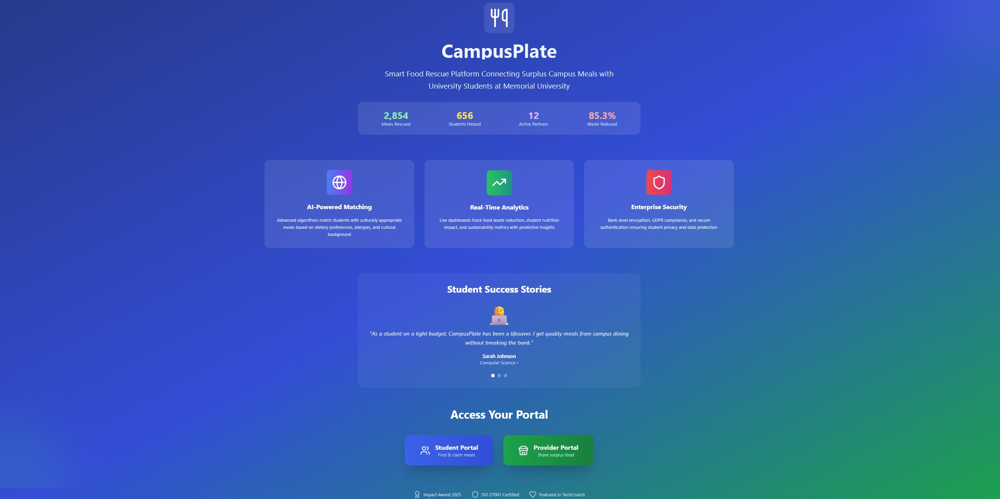

# 🍽️ CampusPlate
Smart Food Rescue Platform for Universities
Connecting surplus campus meals with students in need - turning waste into opportunity

## 🎯 Overview
CampusPlate is a revolutionary food rescue platform designed specifically for university campuses. We tackle two critical issues simultaneously: campus food waste and student food insecurity. By creating a real-time marketplace that connects surplus meals from dining services with students, we're building a more sustainable and equitable campus community.
Built for Memorial University of Newfoundland, CampusPlate demonstrates how technology can drive positive social and environmental impact.

## 🔍 Problem Statement

Universities waste 22 million pounds of food annually in North America
1 in 4 university students experience food insecurity
Campus dining services lose thousands of dollars in disposal costs
Students struggle with rising food costs while quality meals go to waste

At Memorial University specifically:
Large student population with diverse dietary needs
Multiple campus dining locations generating daily surplus
Strong sustainability goals and student wellness initiatives
Perfect environment for a campus-wide food rescue solution


## 💡 Solution
CampusPlate creates a seamless two-sided marketplace:

For Food Providers 🏪

- Real-time meal posting with smart analytics dashboard
- Impact tracking - meals rescued, waste reduced, students helped
- Simple claim management with automated notifications
- Sustainability reporting for university compliance

For Students 🎓

- Instant meal discovery with dietary filtering (Halal, Vegetarian, Vegan, etc.)
- Interactive campus map showing pickup locations and walking times
- Smart urgency alerts for time-sensitive meals
- Fair weekly limits ensuring equitable access for all students

## 🎨 User Experience

- Dual portal system - separate interfaces for students and providers 
- Professional authentication with demo accounts for testing 
- Responsive design - works seamlessly on mobile, tablet, and desktop 
- Real-time synchronization between provider and student portals 
- Beautiful, modern UI with accessibility considerations 

## 📊 Analytics & Impact

- Live statistics dashboard showing meals rescued and students helped
- Provider analytics with success rates and impact metrics
- Sustainability tracking for university reporting
- User engagement metrics and meal popularity insights


## 🛠️ Tech Stack
**Frontend**

- **React 19.1.0** - Modern component-based architecture
- **JavaScript (ES6+)** - Core programming language
- **Tailwind CSS 3.4.0** - Utility-first styling framework
- **Lucide React** - Consistent icon system

**APIs & Services**

- **Google Maps JavaScript API** - Interactive mapping and location services
- **@googlemaps/js-api-loader** - Dynamic map loading

**Development Tools**

- **Create React App** - Build tooling and development environment
- **Node.js & npm** - Package management
- **PostCSS & Autoprefixer** - CSS processing


## 🚀 Installation
**Prerequisites**

- Node.js (v14 or higher)
- npm
- Git

## Setup
```bash
git clone https://github.com/yourusername/campusplate.git
cd campusplate
npm install
npm start
```

The application will open in your browser at http://localhost:3000

Optional: Google Maps Setup
- Get a Google Maps API key from Google Cloud Console
- Create a .env file in the root directory:
- ```REACT_APP_GOOGLE_MAPS_API_KEY=your_api_key_here```

Restart the development server


## 🖥️ Usage
**Getting Started**

- Landing Page - Overview of platform and impact statistics
- Choose Portal - Student or Provider login
- Demo Login - Use provided demo accounts for testing

**Student Workflow**

- Login with student credentials
- Browse available meals with real-time updates
- Filter by dietary preferences (Halal, Vegetarian, etc.)
- View locations on campus map
- Claim meals with one-click (subject to weekly limits)
- Manage active claims with ability to cancel

**Provider Workflow**

- Login with provider credentials
- Post surplus meals with details and pickup information
- Track meal performance with views and claims
- Monitor impact analytics - students helped, waste reduced
- Manage active listings with real-time updates

## 📸 Screenshots



*Beautiful hero section with live impact statistics*


*Student Portal*


*Provider Portal*

## 🌟 Key Achievements

- ✅ Full-featured MVP built in hackathon timeframe
- ✅ Real-time synchronization between provider and student portals
- ✅ Professional authentication system with demo capabilities
- ✅ Advanced claim management with weekly limits and fairness controls
- ✅ Google Maps integration showing actual MUN campus locations
- ✅ Responsive design work
- ✅ Scalable architecture ready for production deployment

## 👥 Team
 🧑‍💻 **Ejaz Khan - Lead Developer & Technical Architect**

- Role: Full-stack development, UI/UX design, technical implementation
- Contributions: React application architecture, Google Maps integration, responsive design, state management, user authentication system
- Contact: ([LinkedIn](https://www.linkedin.com/in/ejaz-dev/))

🧠 **Musayed Ahmed - Business Strategy & Research Lead**

- Role: Market research, business model development, problem validation
- Contributions: Identified target market needs, developed business case, researched university food waste statistics, created go-to-market strategy
- Contact: [LinkedIn](https://www.linkedin.com/in/musayed-ahmed/)

 👨‍💻 **Farhan Reaz - Development Support**

- Role: Frontend development assistance, code review
- Contributions: Component development, debugging, UI improvements, testing
- Contact: [LinkedIn](https://github.com/farhanhaseen22)

---

## 🌐 Live Demo - No Installation Required

<div align="center">
  
**📱 Scan to try CampusPlate instantly:**


</div>

---
  
---
## 🙏 Acknowledgments

*All NL Eats hackathon organizers for creating opportunities to build impactful solutions.*
